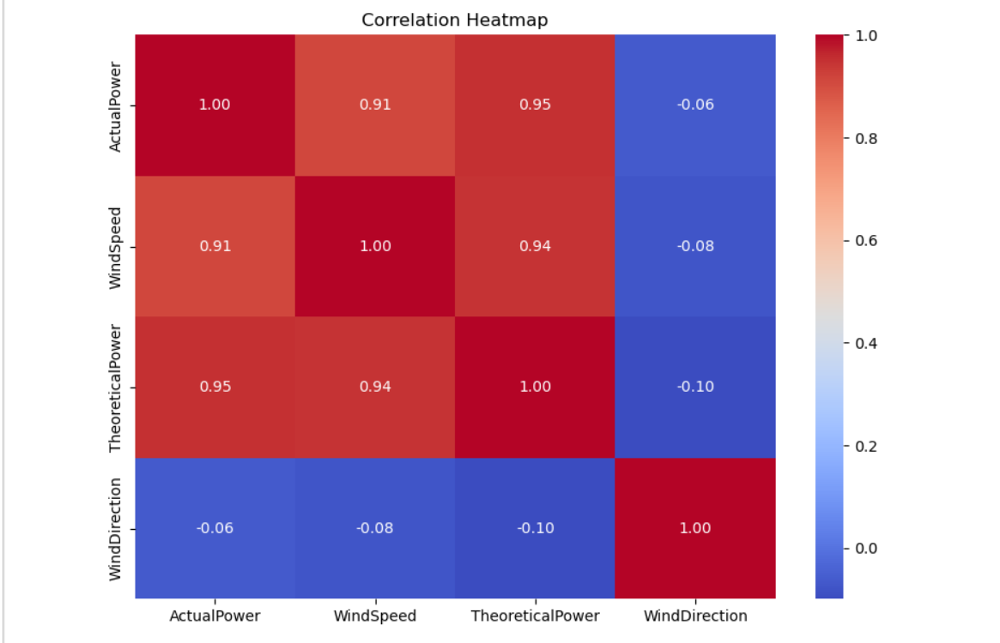
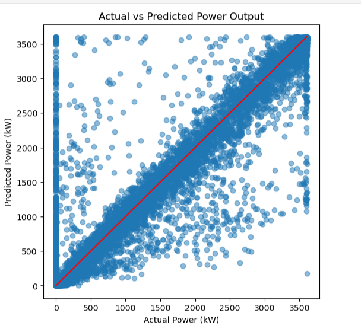
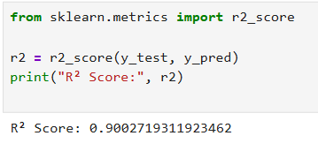
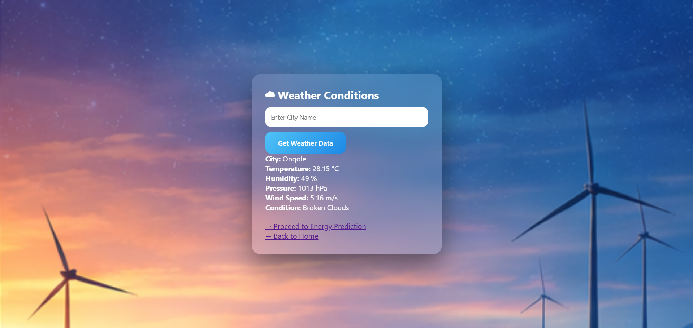
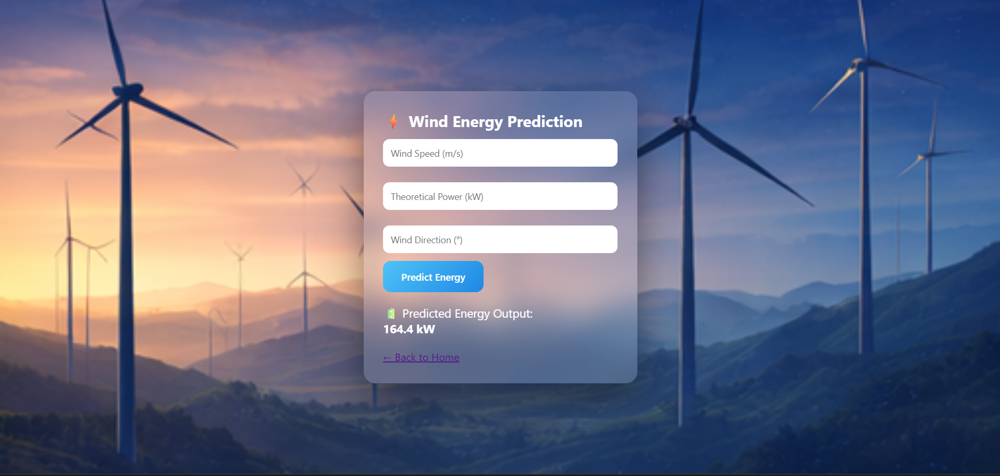

🌬️ Wind Turbine Energy Prediction using Machine Learning

A full-stack Machine Learning + Flask web application designed to predict wind turbine energy output using historical turbine data and real-time weather information.

This project demonstrates the practical application of data preprocessing, machine learning modeling, evaluation, and web deployment in the renewable energy domain.

📌 Project Overview

Wind energy production is highly dependent on environmental conditions such as wind speed and direction. Accurate prediction of wind turbine energy output helps in:

Efficient energy generation planning

Predictive maintenance scheduling

Smart grid integration

This project uses a Random Forest Regression model trained on wind turbine data and integrates live weather data via the OpenWeather API.

🚀 Key Features

🔮 Wind Energy Output Prediction

☁️ Real-time Weather Data Integration

📊 High Model Accuracy (R² ≈ 0.90)

🌐 Interactive Web Application (Flask)

📈 Data visualization for analysis and evaluation

🧠 Machine Learning Details

Algorithm: Random Forest Regressor

Input Features:

Wind Speed (m/s)

Theoretical Power (kW)

Wind Direction (°)

Target Variable: Actual Power Output (kW)

Evaluation Metric: R² Score

📊 Exploratory Data Analysis
🔹 Correlation Heatmap

Shows the relationship between wind parameters and actual power output.

  

📈 Model Performance Evaluation
🔹 Actual vs Predicted Power Output

Visual comparison between predicted and actual turbine power.

  

🔹 R² Score

The trained Random Forest model achieved a strong R² score, indicating high predictive accuracy.

  

🌐 Web Application Interface
🏠 Home Page

  

☁️ Weather Information Page

  

⚡ Energy Prediction Page

  

🛠️ Technology Stack
🔹 Frontend

HTML5

CSS3

🔹 Backend

Python

Flask

🔹 Machine Learning

Scikit-learn

Pandas

NumPy

🔹 Visualization

Matplotlib

Seaborn

🔹 API

OpenWeatherMap API

📂 Project Structure
Wind_Turbine_Energy_Prediction/
│
├── Flask/
│   ├── templates/
│   │   ├── home.html
│   │   ├── weather.html
│   │   └── predict.html
│   ├── static/
│   │   └── images/
│   └── windApp.py
│
├── model/
│   └── train_model.ipynb
│
├── dataset/
│   └── wind_data.csv
│
├── assets/
│   └── images/
│       ├── home_page.png
│       ├── weather_page.png
│       ├── prediction_page.png
│       ├── correlation_heatmap.png
│       ├── actual_vs_predicted.png
│       └── r2_score.png
│
├── README.md
└── .gitignore

⚠️ Model File Notice (IMPORTANT)

The trained model file (model.sav) is NOT included in this repository.

Reason:

GitHub restricts file uploads larger than 100 MB, and the trained model exceeds this limit.

To generate the model locally:

Navigate to the model/ directory

Open train_model.ipynb

Run all cells

This will generate model.sav locally

The Flask application loads the model from the local system during execution.

▶️ How to Run the Project
1️⃣ Clone the Repository
git clone https://github.com/pavan-nune/Wind-Turbine-Energy-Prediction-ML.git
cd Wind_Turbine_Energy_Prediction

2️⃣ Install Dependencies
pip install flask pandas numpy scikit-learn matplotlib seaborn requests

3️⃣ Run the Flask Application
cd Flask
python windApp.py

4️⃣ Open in Browser
http://127.0.0.1:5000

📎 Future Documentation & References (To Be Added)

🔹 Project Report (PDF): [Link will be added here]
🔹 Demo Video: [Link will be added here]
🔹 Presentation Slides: [Link will be added here]

(These placeholders are intentionally kept for future updates.)

📌 Future Enhancements

Add additional weather parameters

Improve model using deep learning (LSTM)

Cloud deployment

User authentication
